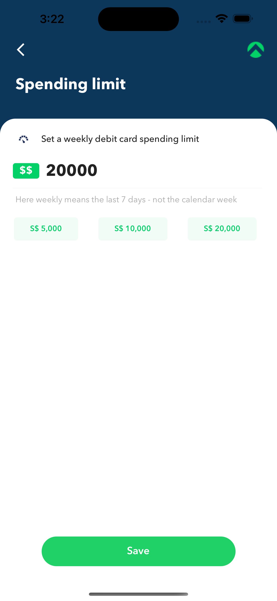
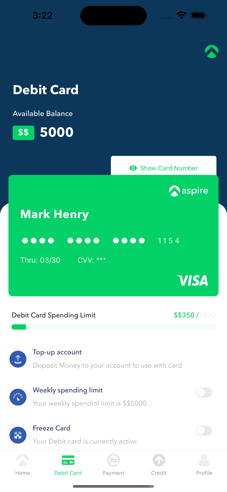

# react-native-debitcard-assignment-aspire
# Requirement
Develop a React native application with two screen
-Debit card screen, where users card details and card settings are dispplayed
-Manage Limit Screen, where user can set weekly spends.

#Technology used
-React Native
-React Navigation
-Redux
-Redux Saga
-React Testing Library

#API url
https://98e755ab7ec740f99e0c256c11b1545d.api.mockbin.io/

#Project Structure
-screens:- Contain main screen or page
-routes:- Containes routes and bottom tabs navigation
-resources:- Contains various assets used
-redux:- contain redux store and redux saga files
-components:- contain all the components used in application
-__test__:= contain all tests
-screenshots:- contain screenshots

#Build and Run commands
-npm buid && npm run ios/android

#Screenshots

